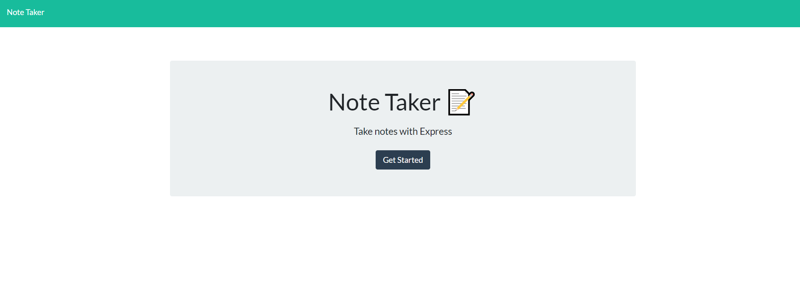
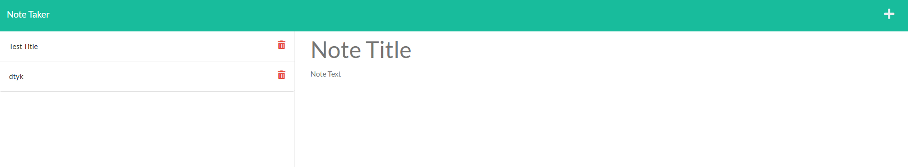

# note-taking-app

https://rocky-headland-04115.herokuapp.com/

## Table of Contents

- [Description](#description)
- [Criteria](#criteria)
- [Installation](#installation)
- [Usage](#usage)
- [Tests](#tests)
- [Technologies Used](#technologies-used)
- [Contributors](#contributors)
- [Questions](#questions)
- [License](#license)

## Description

The note taking app is meant to display daily notes to keep a users thoughts and tasks organized through the day. The user will press the start button to get to the note taking page, where they can generate a new note and append it to the page where it will be saved in the data. If the user would like to delete the note they have the option to do that as well.

To start the note taker app, click the "Get Started" button as shown below.

The image below shows what the app will look like to add a new note or to delete it if the user no longer needs the note reminder.

## Criteria

- GIVEN a note-taking application
- WHEN I open the Note Taker
- THEN I am presented with a landing page with a link to a notes page
- WHEN I click on the link to the notes page
- THEN I am presented with a page with existing notes listed in the left-hand column, plus empty fields to enter a new note title and the note’s text in the right-hand column
- WHEN I enter a new note title and the note’s text
- THEN a Save icon appears in the navigation at the top of the page
- WHEN I click on the Save icon
- THEN the new note I have entered is saved and appears in the left-hand column with the other existing notes
- WHEN I click on an existing note in the list in the left-hand column
- THEN that note appears in the right-hand column
- WHEN I click on the Write icon in the navigation at the top of the page
- THEN I am presented with empty fields to enter a new note title and the note’s text in the right-hand column

## Installation

The user will need to run `npm install` to get all the necessary materials for the code to run.

## Usage

Run `node server.js` to get the code program to run.

## Technologies Used

- HTML
- CSS
- Javascript
- Node.js
- Express.js

## Contributors

The front end of the web app was created by UC Berkeley Full Stack Extension School. 
The back end was created by Kylie Shinn.

- GitHub: [github](https://github.com/kyliemshinn)
- LinkedIn: [linkedin](https://www.linkedin.com/feed/)

## Questions

For additional information please contact me at:
Email: kyliemshinn@gmail.com

## License

MIT License

Copyright (c) [2022] [Kylie Shinn]

Permission is hereby granted, free of charge, to any person obtaining a copy
of this software and associated documentation files (the "Software"), to deal
in the Software without restriction, including without limitation the rights
to use, copy, modify, merge, publish, distribute, sublicense, and/or sell
copies of the Software, and to permit persons to whom the Software is
furnished to do so, subject to the following conditions:

The above copyright notice and this permission notice shall be included in all
copies or substantial portions of the Software.

THE SOFTWARE IS PROVIDED "AS IS", WITHOUT WARRANTY OF ANY KIND, EXPRESS OR
IMPLIED, INCLUDING BUT NOT LIMITED TO THE WARRANTIES OF MERCHANTABILITY,
FITNESS FOR A PARTICULAR PURPOSE AND NONINFRINGEMENT. IN NO EVENT SHALL THE
AUTHORS OR COPYRIGHT HOLDERS BE LIABLE FOR ANY CLAIM, DAMAGES OR OTHER
LIABILITY, WHETHER IN AN ACTION OF CONTRACT, TORT OR OTHERWISE, ARISING FROM,
OUT OF OR IN CONNECTION WITH THE SOFTWARE OR THE USE OR OTHER DEALINGS IN THE
SOFTWARE.
